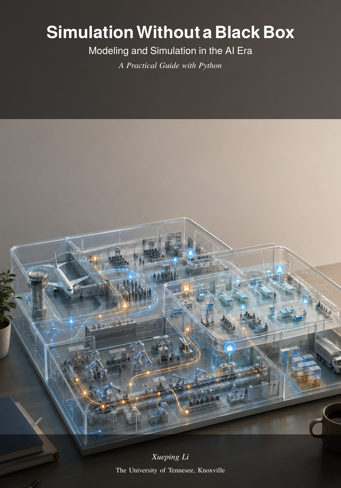

# Simulation Without a Black Box — Open Course Materials

**Discrete-Event Modeling and Analysis for the AI Era**

<p align="center">
  
</p>

Welcome! This is the **public companion repository** for the open textbook
*Simulation Without a Black Box* — a free, code-first course for teaching and
learning discrete-event simulation (DES) with Python and SimPy.

Everything here is free to read, run, and share under the [CC BY-NC-SA 4.0](LICENSE) license.

---

## For Instructors

If you are an instructor adopting this course, we have a **private repository**
with the full instructor package — including **editable slide sources, editable
assignment sources, grading rubrics, and complete annotated solutions** to every
assignment and problem.

<p align="center">
  <a href="https://ilabutk.github.io/courseware_simulation_instructors/">
    <strong>👉 Request Instructor Access</strong>
  </a>
  &nbsp;&nbsp;—&nbsp;&nbsp;verified instructors get a GitHub collaborator invitation to the private repo.
</p>

The public materials here give students everything they need to work through the
course. The instructor-only materials add the tools to teach, customize, and assess.

---

## What's in this repo

| What | Details |
|---|---|
| 📖 **Textbook PDF** | 15 chapters — fully compiled, free to read |
| 📊 **Slide decks** | 41 lecture slide PDFs — ready to present or study from |
| 📓 **Jupyter notebooks** | 46 code-first notebooks — run them, modify them, learn by doing |
| 📝 **Assignments** | 10 assignment/problem-set PDFs — problem statements only (no solutions here) |
| 🧩 **Problem bank** | 121 problems across 15 chapters — conceptual, analytical, trace, coding, and design |
| 🏥 **Case studies** | Outpatient clinic and cargo terminal — 5 phases each, building from first principles |
| 💻 **`simdes` Python package** | Queueing, inventory, clinic, and terminal models on SimPy — install with `pip install -e simdes/` |
| 🐳 **Docker environment** | One command starts JupyterLab with all dependencies pinned |
| 📋 **Syllabus** | Course syllabus and week-by-week schedule |
| 🚀 **Capstone showcase** | EP01: complete example with SimPy model, report, and interactive dashboard |

---

## Quick start

### 1. Clone and enter

```bash
git clone https://github.com/ILABUTK/courseware_simulation_public.git
cd courseware_simulation_public
```

### 2. Start JupyterLab with Docker (recommended)

```bash
docker compose -f environment/docker-compose.yml up jupyter
# Open http://localhost:8888 in your browser
```

The Docker image includes Python 3.10+, SimPy 4.1+, `simdes`, JupyterLab, NumPy,
SciPy, Pandas, Matplotlib, and Gymnasium — all version-pinned. No "works on my
machine" problems.

### 3. Or use a local Python environment

```bash
python -m venv .venv
source .venv/bin/activate          # .venv\Scripts\activate on Windows
pip install -r environment/requirements.txt
pip install -e simdes/
jupyter lab
```

Requires Python 3.10+.

---

## What's where

```
courseware_simulation_public/
├── README.md                    # You are here
├── LICENSE                      # CC BY-NC-SA 4.0
├── CITATION.cff                 # How to cite this work
│
├── book/
│   ├── simulation-without-a-black-box.pdf   # The compiled textbook
│   └── cover.png                           # Book cover
│
├── course/
│   ├── syllabus/                # Syllabus PDFs
│   ├── modules/                 # M01–M12: slide PDFs + Jupyter notebooks + readings
│   ├── assignments/             # Assignment/problem-set PDFs
│   ├── problem_bank/            # 121 problems (ch01–ch15)
│   ├── case_studies/            # clinic/ and terminal/ (5 phases each)
│   └── data/                    # CSV datasets
│
├── showcase/ep01/               # Capstone demo: model, report, dashboard app
├── simdes/                      # Python package (pip install -e simdes/)
└── environment/                 # Dockerfile, docker-compose.yml, pinned requirements
```

---

## How the course is organized

The course has 12 modules mapped to 15 textbook chapters:

| Module | Topic | Chapters |
|---|---|---|
| M01 | Why Simulation? | 1 |
| M02 | Conceptual Modeling | 2–3 |
| M03 | The DES Worldview | 4–5 |
| M04 | Python Tools | 6 |
| M05 | SimPy Queues | 7 |
| M06 | Advanced DES | 8 |
| M07 | Input Modeling | 9 |
| M08 | Output Analysis | 10 |
| M09 | Experimental Design | 11 |
| M10 | Verification & Validation | 12 |
| M11 | Simulation Optimization | 13 |
| M12 | Reinforcement Learning | 14–15 |

Each module includes slide PDFs, a runnable Jupyter notebook, and reading notes.

---

## How to use these materials

- **Self-learners**: Start with the syllabus for the week-by-week plan, then
  work through modules M01→M12. Read the textbook chapter, study the slides,
  and run the notebook. Attempt the assignments and check your understanding
  against the problem bank.
- **Students in a course**: Your instructor will guide you through the modules
  and assign specific problems. The notebooks are your lab — run them, break
  them, fix them. That's how you learn.
- **Instructors**: See the **For Instructors** section above — you'll want
  access to the private repo for editable sources, rubrics, and solutions.

---

## About the book

*Simulation Without a Black Box* teaches discrete-event simulation from the
inside out. Instead of proprietary GUI tools with hidden internals, every
model is built in readable Python using SimPy. Students see the event list,
the random number stream, and every state transition — because they wrote the
code.

The book is designed for the AI era: because simulation models are Python
classes, they connect naturally to NumPy, Pandas, scikit-learn, PyTorch, and
Gymnasium. Build a DES model today, plug it into a reinforcement learning
agent tomorrow.

---

## License

Course materials (text, slides, notebooks, assignments, problems) are licensed
under [CC BY-NC-SA 4.0](LICENSE). You may share and adapt them for
non-commercial educational use with attribution.

The `simdes` Python package is licensed separately under the [MIT License](simdes/LICENSE).

---

## Contact

Xueping Li — University of Tennessee, Knoxville
- [xli.utk.edu](https://xli.utk.edu)
- `xli27@utk.edu`

---

**Built for the AI era — open, transparent, code-first.**
